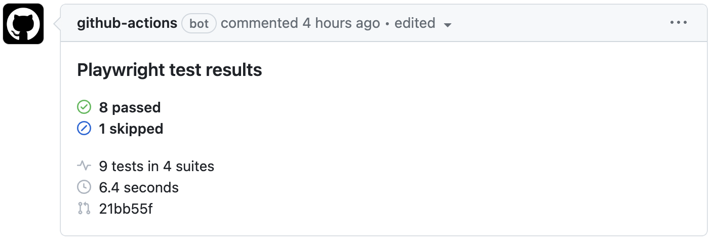
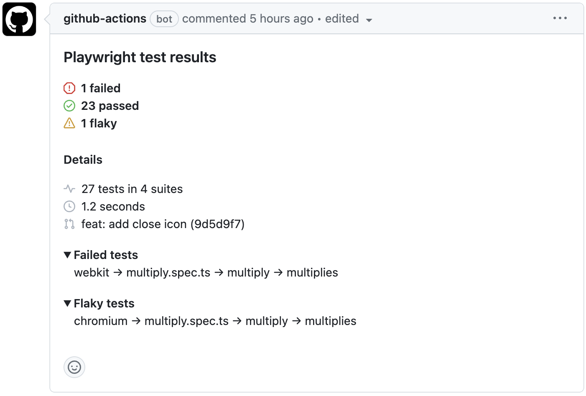

#    Playwright Report Summary

[](https://github.com/super-linter/super-linter)


A GitHub action to report Playwright test results as a pull request comment.

- Parse the JSON test report generated by Playwright
- Generate a markdown summary of the test results
- Post the summary as a pull request comment
- Uses GitHub's official [icons](https://primer.style/design/foundations/icons) and [color scheme](https://primer.style/design/foundations/color)

## Examples





## Usage

### Basic usage

Playwright must be configured to [generate a JSON report](https://playwright.dev/docs/test-reporters#json-reporter)
and write it to disk. This action receives the report file path as input, in this case `results.json`.

Note the `if: always()` to ensure the report comment is created even if the tests failed.

```yaml
jobs:
  test:
    name: Run playwright tests
    needs: install
    steps:
      - uses: actions/checkout@v4
      - uses: actions/setup-node@v3
        with:
          node-version: 20

      - run: PLAYWRIGHT_JSON_OUTPUT_NAME=results.json npx playwright test --reporter=json

      - uses: daun/playwright-report-summary@v3
        if: always()
        with:
          report-file: results.json
```

### Usage with custom commenting logic

The action will do the work of creating comments and updating them whenever tests re-run. If you
require custom logic for creating and updating comments, you can disable the default logic and use
any other action in combination with the `summary` output of this action.

A few recommended actions are
[Sticky Pull Request Comment](https://github.com/marketplace/actions/sticky-pull-request-comment)
and [Create or Update Comment](https://github.com/marketplace/actions/create-or-update-comment).

```diff
  - uses: daun/playwright-report-summary@v3
    if: always()
    id: summary
    with:
      report-file: results.json
+     create-comment: false

+ - uses: marocchino/sticky-pull-request-comment@v2
+   with:
+     message: ${{ steps.summary.outputs.summary }}
```

## Options

```yaml
- uses: daun/playwright-report-summary@v3
  if: always()
  with:
    # The GitHub access token to use for API requests
    # Defaults to the standard GITHUB_TOKEN
    github-token: ''

    # Path to the JSON report file generated by Playwright. Required.
    report-file: 'results.json'

    # A unique tag to represent this report when reporting on multiple test runs
    # Defaults to the current workflow name
    report-tag: ''

    # URL to a published html report, uploaded by another action in a previous step.
    # Example pipeline: https://playwright.dev/docs/test-sharding#publishing-report-on-the-web
    report-url: 'https://user.github.io/repo/yyyy-mm-dd-id/'

    # Number of the pull request to comment on. This is only required if the action
    # is run outside a pull request context or needs to comment on another PR.
    pr-number: 123

    # Whether the action should create the actual comment. Set to false to implement
    # your own commenting logic.
    # Default: true
    create-comment: true

    # Title/headline to use for the created pull request comment.
    # Default: 'Playwright test results'
    comment-title: 'Test results'

    # Additional information to include in the summary comment, markdown-formatted
    # Default: ''
    custom-info: 'For more information, [see our readme](http://link)'

    # Create a job summary comment for the workflow run
    # Default: false
    job-summary: false

    # Icon style to use: octicons | emojis
    # Default: octicons
    icon-style: 'octicons'

    # Command used to run tests. If provided, a command to re-run failed or
    # flaky tests will be printed for each section.
    # Default: ''
    test-command: 'npm run test --'

    # Additional content to add to the comment below the test report.
    # Default: ''
    footer: ''
```

## Output

The action creates three output variables:

### summary

The rendered markdown summary of the test report.

### comment-id

The ID of the comment that was created or updated

### report-data

The raw data of the test report, as a JSON-encoded string. This is
useful for creating custom summaries or debugging. You can get an idea
of the data structure by checking out the [ReportSummary interface](https://github.com/daun/playwright-report-summary/blob/main/src/report.ts#L13).

## License

[MIT](./LICENSE)
